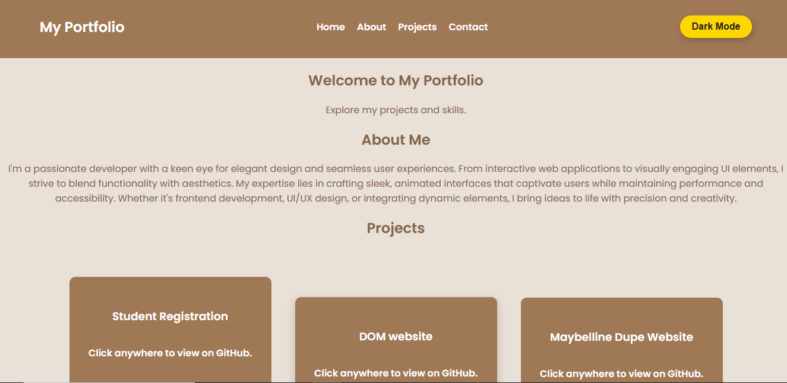
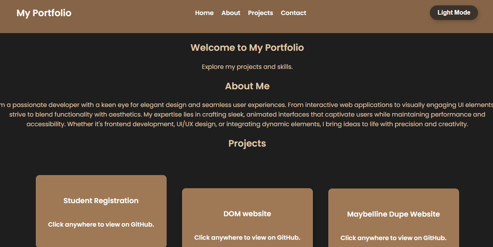

# My Portfolio Website

## 📌 Overview
This is my personal portfolio website showcasing my projects, skills, and contact information. The website has both **Light Mode** and **Dark Mode** with interactive hover effects and a clean, minimalistic design.

## 🚀 Features
- 🎨 **Light Mode & Dark Mode Toggle** with different themes.
- 🖱 **Project Hover Effects** that enhance the UI.
- 📂 **Clickable Projects** that link to GitHub repositories.
- ✉ **Contact Form** for user inquiries.
- 🖌 **Responsive & Elegant Design** with smooth transitions.

## 🛠 Technologies Used
- **HTML5**
- **CSS3 (Flexbox & Grid)**
- **JavaScript (GSAP for animations)**
- **Git & GitHub for version control**

## 🎥 Demo
  

## 📝 How to Use
1. Clone the repository:
https://github.com/shravani012/Portfolio.git
2. Open `index.html` in a browser.
## 📄 File Structure
/my-portfolio├── index.html # Main HTML file ├── CSS/ │ ├── style.css # Styling file ├── Js/ │ ├── script.js # JavaScript file for animations & toggle ├── README.md # Project Documentation

## 📬 Contact
If you have any questions or suggestions, feel free to reach out.

- **Email:** joshishravani78@gmail.com
- **GitHub:** [shravani012](https://github.com/shravani012)

